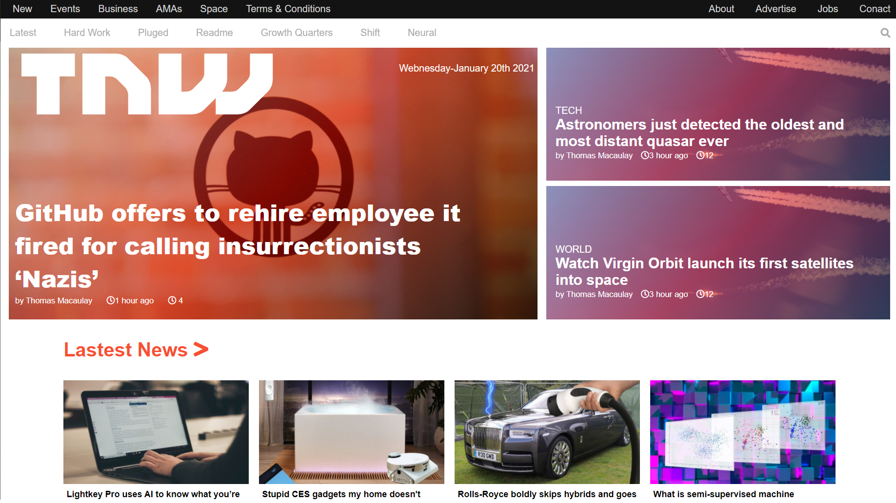

# Project 2: Building with responsive design

> This project consists of replicating the The Next Web website putting emphasis on how it behaves differently depending on the size of the screen where the website is rendered.

This replica of the Next Website has different breakpoint for the different sizes of the most popular screens.

## Built With

- HTML
- CSS

## Live Demo

[Live Demo Link](https://rashad-muntar.github.io/the-new-web/)

## Authors

👤 **Rashad Muntar**

- GitHub: [@Rashad-Muntar](https://github.com/Rashad-Muntar)
- Twitter: [@Rashad-Toure](https://twitter.com/twitterhandle)

👤 **Juan Carlos Campos**

- GitHub: [@sjcco](https://github.com/sjcco)
- Twitter:[@CarlosCamposO](https://twitter.com/CarlosCamposO)

## 🤝 Contributing

Contributions, issues, and feature requests are welcome!

Feel free to check the [issues page](issues/).

## Show your support

Give a ⭐️ if you like this project!

## Acknowledgments

- [Micoverse team](https://microverse.pathwright.com/library/new-technical-curriculum/177956/path/step/104246979/)

## 📝 License

This project is [MIT](lic.url) licensed.
